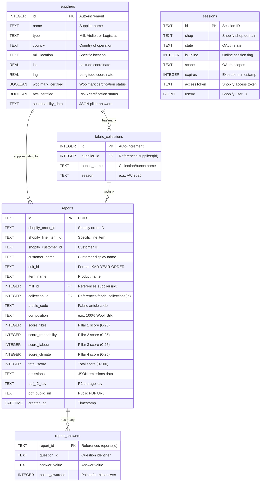

# Database Schema - Transparency Passport

## Entity Relationship Diagram

## Table Descriptions

### suppliers
Stores information about fabric mills, ateliers, and logistics providers.

**Key Relationships:**
- One supplier can have many fabric collections
- One supplier can be referenced by many reports (as the mill)

**Special Fields:**
- `sustainability_data`: JSON string containing pre-filled sustainability answers for the supplier

### fabric_collections
Fabric bunches/collections from suppliers, organized by season.

**Key Relationships:**
- Each collection belongs to one supplier
- One collection can be used in many reports

### reports
Core table storing transparency passport reports for each garment.

**Key Relationships:**
- References `suppliers` via `mill_id`
- References `fabric_collections` via `collection_id`
- Has many `report_answers`

**Scoring Fields:**
- `score_fibre`: Pillar 1 - Fibre & Material Health (0-25)
- `score_traceability`: Pillar 2 - Traceability (0-25)
- `score_labour`: Pillar 3 - Social Responsibility & Labour (0-25)
- `score_climate`: Pillar 4 - Climate & Circularity (0-25)
- `total_score`: Sum of all pillars (0-100)

**Emissions Field:**
- JSON structure containing:
  - `locations`: Primary, mill, production, warehouse coordinates
  - `legs`: Transport segments with distance, mode, emissions
  - `totalDistance`: Total km traveled
  - `emissionsKg`: Total CO₂ emissions

### report_answers
Audit log of all question answers for each report.

**Key Relationships:**
- Each answer belongs to one report
- Multiple answers per report (one per question answered)

**Purpose:**
- Enables detailed breakdown of scoring in PDF
- Provides audit trail
- Allows for score recalculation if needed

### sessions
OAuth session management for Shopify app authentication.

**Purpose:**
- Stores Shopify access tokens
- Manages session expiration
- Tracks online/offline sessions

## Indexes

Recommended indexes for performance:
- `reports(shopify_order_id)` - Fast order lookup
- `report_answers(report_id)` - Fast answer retrieval
- `fabric_collections(supplier_id)` - Fast collection filtering
- `sessions(shop)` - Fast session lookup
